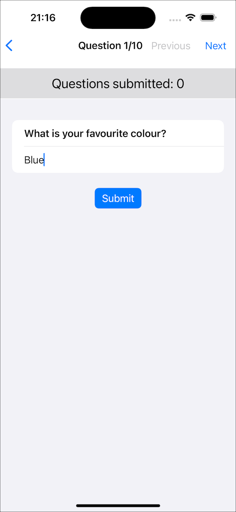
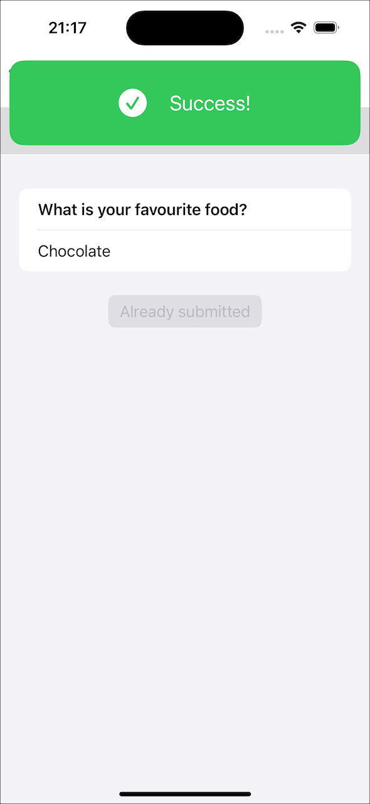

# Survey-TCA-sample
Survey sample app using The Composable Architecture (TCA). 
The app consist of two screens. Pressing the "Start survey" button will load the
second screen that will display the list of survey questions.
The second screen is a horizontal pager of all the questions with previous, next buttons and submit button.
Upon submission of the question answer, notification banner is shown.
The app connects to the rest api to get the list of questions.

Jump to

- [Screenshots](#screenshots)
- [Project structure](#project-structure)
- [Tests](#tests)
- [Future work](#future-work)

## Screenshots 

&nbsp;
 

&nbsp;
 

## Project structure

<table style="border-collapse: collapse; ">
<tr>
<td style="vertical-align: top;">

</td>
<td style="vertical-align: top;">
Project has 2 main groups: App and Modules. 
App contains main app views along with master detail navigation defined.  
Modules group contains implementation of initial start screen, survey questions, custom views and service. 
Potentially, Modules could be moved to separate packages if needed. 
 
Look inside the code for particular file comment.
</td>
</tr>
</table>

[back to top](#readme)

## Tests

<table style="border-collapse: collapse; ">
<tr>
<td style="vertical-align: top;">

</td>
<td style="vertical-align: top;">
Project contains unit tests for futures/reducers and also for api service live/mock. 
 
UI tests are also provided.
</td>
</tr>
</table>

[back to top](#readme)

## Future work
Potential future work/discussion/questions:

- When user presses Submit button on question screen, perhaps the button should be disabled while calling API service?
- When submittion fails, perhaps Submit button should be disabled cause Retry button is available?
- Perhaps questions should be loaded when user presses Start button and not on questions screen?

[back to top](#readme)